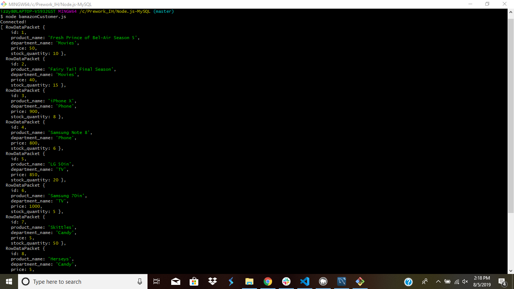
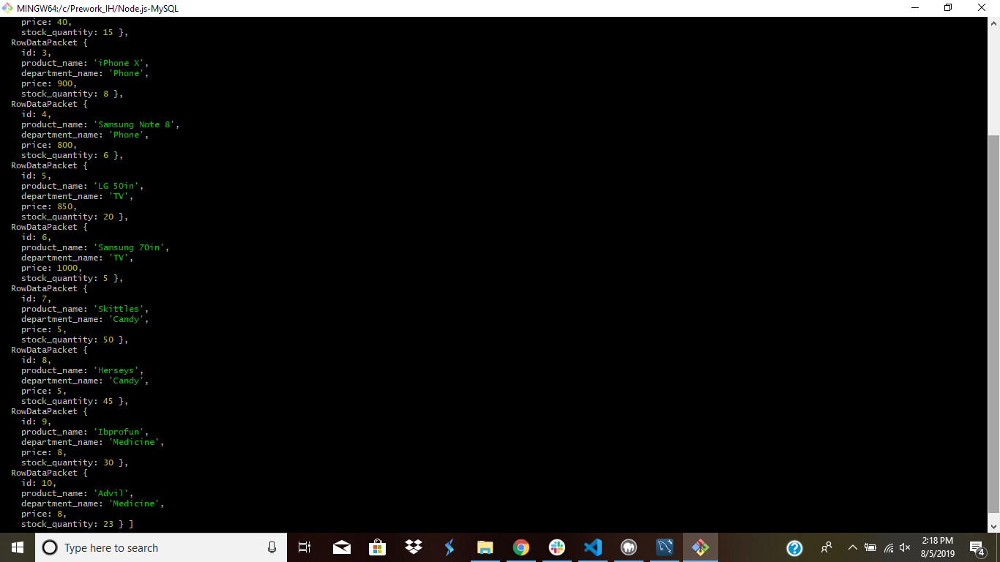
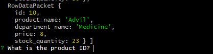
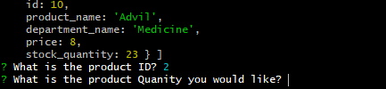
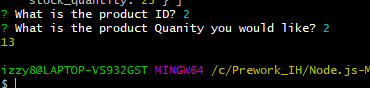

# Node.js-MySQL

I've created an Amazon-like storefront with the MySQL skills I learned this unit. The app will take in orders from customers and deplete stock from the store's inventory.

# Inquirer prompt Questions:
- ask for product ID
- ask for Quantity of product

# I use these npms.

* inquirer
* mysql

# How To Use bamazon
1. First step is to download inquirer and mysql in your command prompt or git bash.
2. Second step is to open the command prompt at the Node.js-MySQL folder.
3. Next type in:
```node bamazonCustomer.js``` (or whatever you named your JavaScript file).
4. Then it will show you the products that are in the database.


5. After that it will as you for the ID of the product you want (type in the ID number).

6. It will then ask you for the Quantity of the amount of the product you want (type in the Quantity amount).

7. Then it will show you the Quantity that is left over.

8. After that is done you can rerun the ```node bamazonCustomer.js``` or open up the MySQL database and it will show that it updated.
Before:
.png)
After:
.png)


# Files Used
- .gitignore
- bamazon_db.sql
- bamazonCustomer.js
- package-lock.json

# Creator of App
Israel Harvin 7/29/2019
